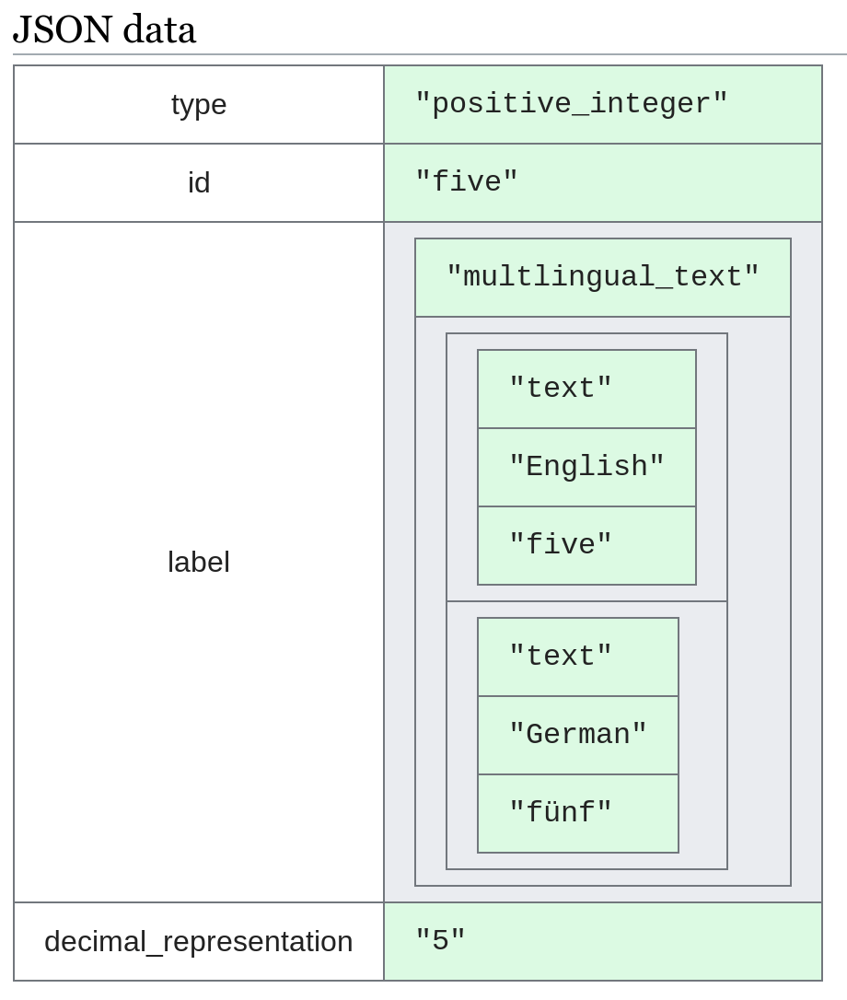
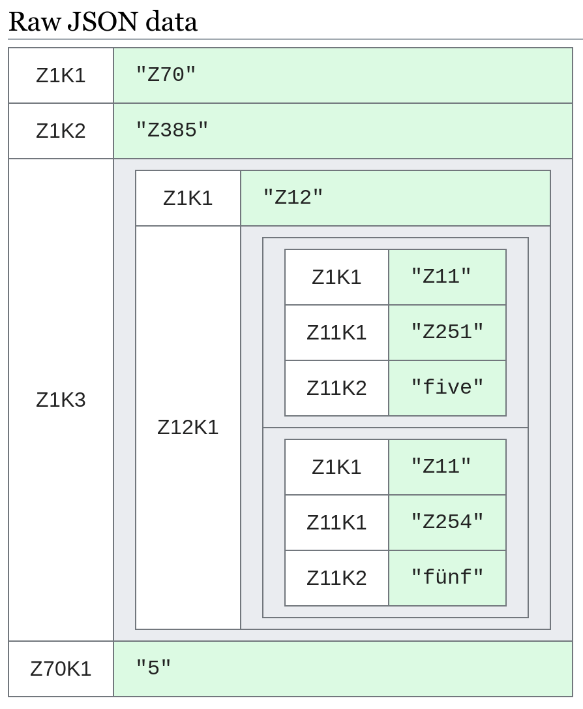
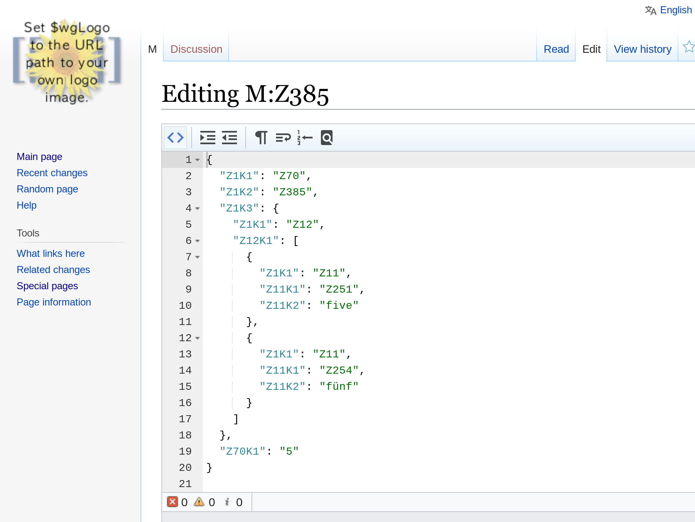
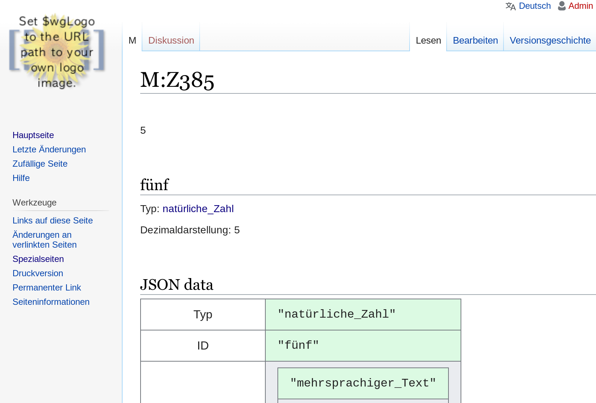
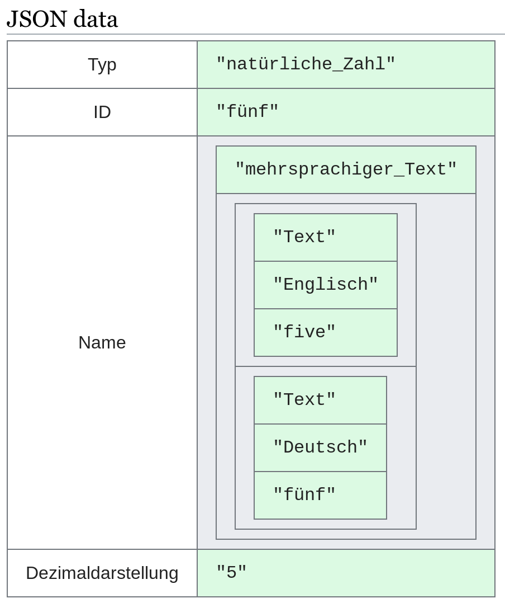
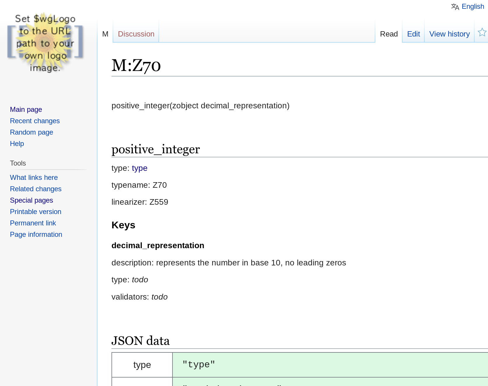
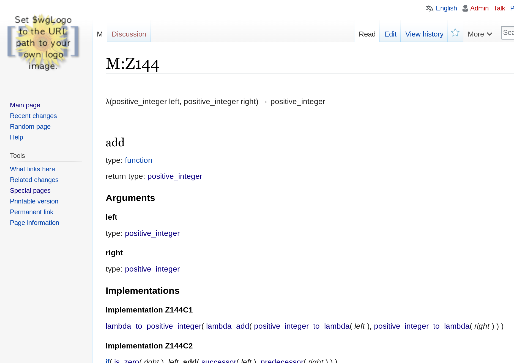
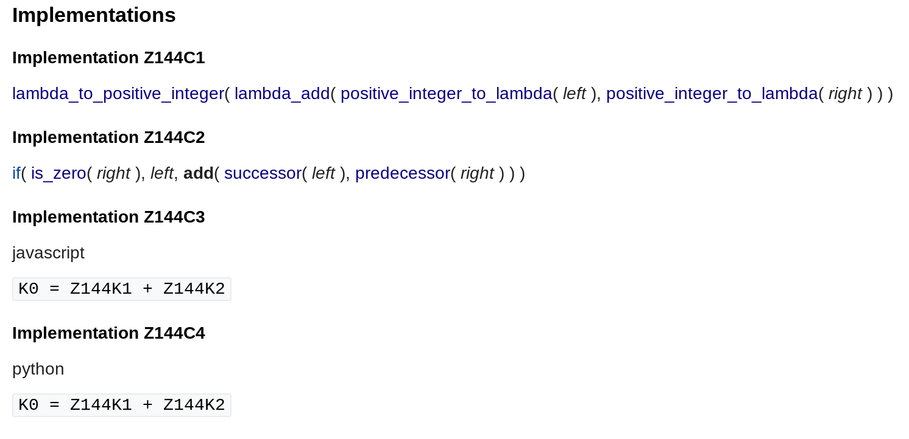
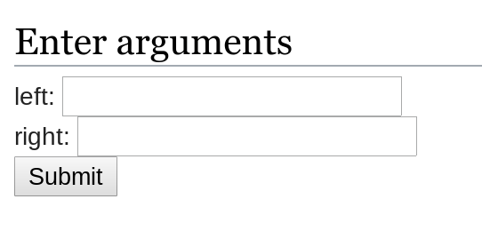

# Walkthrough of AbstractText

## Intro

AbstractText is a prototype implementation of the Wikilambda idea.
It implements the ability to collaboratively write and maintain abstract Content and functions, most importantly functions to translate the abstract Content to natural language.

Whereas it would probably be easiest to have a public demo, the thing is that the prototype is **not safe** to run publicly.
One can enter, through the Web interface, arbitrary code and execute it on the server.
This is **very not good**.
So, instead of providing a public demo instance, this walkthrough takes you through a few of the ideas of AbstractText.

In short, the idea is that AbstractText is an extension of MediaWiki that allows to store and evaluate Z-Objects.
Z-Objects can be functions, values, types, and more.
The actual evaluation of the function calls is done by a JavaScript library called *eneyj*.
Unlike the MediaWiki extension, it should be safe to install and run `eneyj`.

This document contains some details which can be safely skipped while reading.
There are originally collapsed like this and you can click on them to read the details:

<details>

> This is roughly the fourth of fifth prototype I have tried out, and many ideas have been thrown away before.
It is also the first prototype I am mildly happy with, as the others where mostly not expressive enough to achieve the stated goal.
Having said that, this is still a prototype, not a finished product.
It has tons of wrinkles.
I am not a master coder, and also parts of this are merely implemented to test out certain ideas, with little regard on how polished the overall picture is.
I expect that this code needs to be either mostly rewritten, or to be restarted entirely from scratch, in order to achieve the goals of the project.
There are many bugs, omissions, missing features, and inconsistencies.
>
> If you want to fix some of them, you are more than welcome to do so!
</details>

For more reading on the background of Wikilambda and Abstract Wikipedia, see here:
* [Capturing meaning: Toward an abstract Wikipedia](https://research.google/pubs/pub48057/) (short intro)
* [Architecture for a multilingual Wikipedia](https://arxiv.org/abs/2004.04733) (techical aspects)
* [Collaborating on the sum of all knowledge across languages](https://wikipedia20.pubpub.org/pub/vyf7ksah) (social aspects)
* [Wikipedia Signpost article](https://en.wikipedia.org/wiki/Wikipedia:Wikipedia_Signpost/2020-04-26/In_focus)

## MediaWiki extension

### A simple Z-Object

There are two types of Z-Objects, permanent and transient ones.
A permanent Z-Object has a ZID (a Z followed by a number) and is stored on a page in the wiki.

<details>

> Well, all the Z-Objects should be in the wiki, and when they are changed in the wiki, these changes should be reflected when evaluating Z-Objects.
The wiki should be the source of truth.
> Alas, it isn't.
> For developing the prototype, it proved easier to have the Z-Objects just as files on disk (they are in the directory [`eneyj/data`](../data), and not to have a MediaWiki server up and running so the evaluator can access Z-Objects.
>
> There are scripts in [`eneyj/scripts`](../src/scripts) to either load the Z-Objects from wiki to the data directory, or the other way around.
> But in the prototype it is up to you to not edit in both places at the same time, or else you won't be able to easily sync them.
>
> Accordingly, if you are looking for the file for the Z-Object we discuss here, it is at [`eneyj/data/Z385.json`](../data/Z385.json).
</details>

Here is a very simple such Z-Object, representing the number 5.


We first see the ZID (Z385 in this case), followed by a rendering of the value of this Z-Object (which is, well, 5).
This is followed by the name (five), and then it shows the type of the Z-Object (since every Z-Object has a type), which is positive integer, and based on the type it also has one further slot, decimal representation, which is filled with the string "5".

<details>

> In the wiki, Z-Objects really should have been in the main namespace.
> Instead, they are in a namespace called `M`, which is why the URL to this page in the wiki won't be `wiki/Z385`, but `wiki/M:Z385`.
> Even worse, some of the scripts assume that namespace.
> Hey, I told you it's a prototype!
</details>

Below that, we see a tabular representation of the JSON data, with all IDs replaced with labels. Every Z-Object can have, besides a type, an ID, a label, a description, and other metadata. Labels and descriptions are multilingual texts, which in turn is a list of texts, and texts have a language and a string content.



Now, in reality this is not what is stored in the wiki.
The structure is as given, but all the keys and identifiers are ZIDs or key ids.
So, that is why in reality, the JSON structure looks like this (and is displayed in the wiki below the table above).



We can see that `Z1K1` is the key id for "id", and `Z1K3` is the key id for "label", and `Z70K1` is the key id for "decimal representation", and the above table shows exactly this translated version.

This is also what you will edit in case you dare to click on the edit button.
Which obviously leads to one of the biggest todos for the prototype.
The editing experience leaves a certain room for improvement.



<details>

> Yes, a lot of room for improvement.
</details>

On the top of the wiki page, you can find the button provided by the [Universal Language Selector](https://www.mediawiki.org/wiki/Extension:UniversalLanguageSelector) that allows you to change the language.
There we can for example switch to German, and we see this page be displayed in German.



The JSON data below is also showing all in German.



The system aims to support all MediaWiki languages.
Let's switch back to English.

<details>

> But I didn't actually add labels for those in more than a few places for German.
> Also, there is currently no support for other languages then English, German, Croatian, Uzbek, and Serbian.
> We would need to create the Z-Objects for the other languages, which is quite easy.
</details>

### Types of Z-Objects

The type field of `Z385` in the first screenshot above linked to "positive integer".
Positive integer is not a primitive type in AbstractText, but is defined in AbstractText itself, in fact as the Z-Object with the ZID `Z70`.
In fact, there are no primitive types - all types are Z-Objects.



Types in Wikilambda are Z-Objects of the type Type (`Z4`).
`Z70` defines the keys that are available for an instance of this type, and whether these keys are optional or not, the labels of the keys, etc.
A type is defined by validators to check whether a value is valid, a linearizer, i.e. a function that turns a value of this type into a string for display purposes, etc.

<details>

> The goal is to have [validators](../src/validate), linearizers, [evaluators](../src/evaluate), etc. all be described as Z-Objects.
> In practice, this wasn't yet achieved, and whereas the linearizers and other functions have been internalized (which means turned into functions as Z-Objects instead of being code in eneyj itself), this internalization was only achieved partially.
> One particular linearization that I wanted to get to was the display of Z-Objects in the wiki.
> These are currently not even implemented in eneyj, but in the [PHP MediaWiki extension](../../includes/AbstractTextContent.php).
> This also means that creating types without changing the code is not really achieved yet, as there are several bits and pieces that need code to be extended.
> The goal really would be to completely internalize code and allow the creation of new types without changing a single line of eneyj or AbstractText.
</details>

### Functions

Arguably the most interesting type of Z-Object is the *function*.
We will take a look at a simple function here, the add function, `Z144`.
The first line after the ZID shows us that we are talking about a function (there is a little lambda there, saying that the value of this Z-Object is an anonymous function, and that takes two arguments of type positive integer and returns a positive integer.

The same information is given below again:
the name of the function (add - again, this is per user language), then fields telling us that this is a function that returns a positive integer, takes two arguments (left and right, both being positive integers).
So this defines the signature of the function.



Below that we see a list of implementations for the add function.

Now, you might think, what, why do I need an implementation for the add function?
And even worse, why do I have *four* implementations of the add function.

Remember that the goal is to provide a catalog of functions.
And whereas some functions may be defined as primitive - these are called builtins - one goal is to keep their number as low as possible.
Also, it can be instructive to see the implementations of such presumably simple functions.

<details>

> One goal is to get rid of most [builtins](../src/builtin).
> This isn't mostly that hard, particularly since implementations can be written in JavaScript, so there is really no need to have builtins, really - unless it is to access capabilities that break the restrictions of AbstractText's meager safety and evaluation model.
> So we expect to have builtins that will stay for things like "get the time", or "make a REST call" or "get the version of eneyj" or similar.
</details>



Here are the four implementations of the add function.

`Z144C1`: The first one turns the arguments to lambda functions (in [lambda calculus](https://en.wikipedia.org/wiki/Lambda_calculus), every number can be represented as a lambda function), then uses the implementation of add in the lambda calculus on the lambda functions representing the numbers, and finally figures out what integer does the resulting lambda function represent.
This explanation will probably sound utterly wild if you don't have a working model of how the lambda calculus works. Feel free to ignore this implementation.
The advantage of eventually falling back to the lambda calculus is that this way we can keep everything inside AbstractText, and don't have to fall back to an implementation in a programming language.

`Z144C2`: This is a nice, composed, and recursive implementation of the add function.
In the wiki, you can click on any of the function names and get to the page with the respective Z-Object (remember that all functions are Z-Objects).
So you can go to successor and find that it is a function that takes a positive integer and returns the next larger positive integer.

This implementation first checks if the right argument is zero, and if so, we are done, and it returns the left argument. Then it calls the add function itself (i.e. it calls the function on this very page) on the successor of the left argument and the predecessor of the right argument, that means, it removes 1 from left and adds 1 to right, and calls add on the result.
By having add call itself repeatedly, left will eventually get down to zero (remember that the type is *positive* integer!), and then right will contain the sum of the original two arguments.

`Z144C3` and `Z144C4` are implementations of the add function in JavaScript and Python respectively, and there we just use the primitive `+` that those languages offer.
When these implementations are used, eneyj turns the Z-Object representing the arguments of the function into an appropriate value, runs the provided code snippet, and returns the result, translated back to a Z-Object.
This way we can smoothly (but not efficiently) jump from composed implementations to implementations in different programming languages.

In order to decide which implementation to choose, AbstractText has scripts to measure how long the implementations take with different sets of values (and ensures that their results are the same), and then calibrates based on these results.

<details>

> 1.) Note that here implementations are part of the function, and have ZIDs that indicate that subentity relation, e.g. `Z144C1`.
The same is true for tests for functions.
By now I am convinced that this is a mistake, and both implementations and tests should be independent, permanent Z-Objects with a proper ZID.
This will allow to freeze a function specification, but still allow to work on new implementations or tests, which sounds like a good idea.
>  
> 2.) It is very ugly that the implementations in the programming language here display the raw names of the arguments, i.e. Z144K1 etc.
This should be fixed for display.
>
> 3.) Reminder: there is nothing that checks that the code entered in the implementations is safe.
This is the main reason why one should not run a public instance of AbstractText.
It allows anyone who has access to the instance to write arbitrary code and get it executed on the server of the wiki.
>  
> 4.) The implementations in JavaScript and Python here are not strictly equivalent to the two first implementations, because in fact the type of positive integer are not strictly equivalent.
Both in JavaScript and Python AbstractText translates the positive integer type to the basic integer type in JavaScript and Python, and these numbers have an upper limit, whereas the positive integer defined here, theoretically does not.
Practically you will never run the second implementation on a really big number though, because it is so grossly inefficient, that the difference mentioned here does not matter.
For a proper fix for that though we should probably introduce an integer type with an upper bound, so that we can take advantage of implementations such as `Z144C3` and `Z144C4`.
>
> 5.) Running Python in eneyj is much slower than running JavaScript in most cases, because eneyj is written in JavaScript and just uses the `eval` function while it starts up a whole Python environment every time it runs Python code.
That can be very much improved, obviously.
>
> 6.) The current evaluation strategy is very inefficient and has a lot of room for improvement.
</details>



Finally, every page representing a function should have a form that allows to easily call this function with user-provided arguments.
So in the form above, you can simply enter two numbers, click on submit, and then a JSON answer is being displayed.

<details>

> 1.) It would be better to display the result inline instead of a separate page with some JSON.
>
> 2.) Currently, this form only works for functions with two parameters that are both positive integers.
This needs to be improved.
Unfortunately, that isn't as easy to improve as it sounds:
probably the best way to do that is to introduce functions that parse a type from a string, so that that can be called on the input before giving the arguments to the actual function.
</details>


That's enough about the wiki for now.
Additionally to what we mentioned there is a new API module to evaluate function calls.
But for development, I found it far easier to use the command line tool described in the next section.

## eneyj basics

`eneyj` is a command line interface and JavaScript library that evaluates Z-Objects.
In fact, it can be installed entirely without bothering to install a MediaWiki server and the AbstractText extension.
Just go to the directory `eneyj` and run `npm install`, and you should be ready to use `eneyj` from the command line (you will need to install [npm](https://www.npmjs.com/) first).

<details>

> After running npm install, you also need to do the following steps. The measure step will take a while.

```
cd abstracttext/eneyj
mkdir config
mkdir config/runs
node src/scripts/labelMap.js
cp src/scripts/calibration-initial.json config/calibration.json
node src/scripts/measure.js --chatty
node src/scripts/calibrate.js
```

> Yes,a better installation process would be nice.
</details>

Even if you are using only the command line interface, it will likely make sense to read the above section on the MediaWiki extension, as it introduces a lot of the concepts required in the following section.

Regarding the name: eneyj stands for NH which stands for "Natural language generation system Host", and is based on the fact that it was developed to support the creation of natural language from abstract content.

### Starting up eneyj

In order to start eneyj, you type into your shell ([node](https://nodejs.org/en/) is required, which you probably already have since you installed npm before):

```
$ node abstracttext/eneyj/src/eneyj.js
eneyj v0.1.0
language is set to English
Enter .help for help
>
```

The system tells us its version, which language it is using for parsing, and that you can type `.help` to get a short help at any time.
All commands that start with a dot go to the command line shell, whereas everything else is being interpreted as a Z-Object. `.help commands` gives you a list of all dot commands (including `.quit`, which ends the shell).

One feature I like is to switch on the timer via `.timer on`, as it displays me how long the evaluation of a command took.

The shell offers history (cursor up and down to go through it), even across sessions, and autocompletion (using the tab).

### Function calls

Let us call the add function that we got to know earlier:

```
> add(five, three)
8
```

What is going on here?

First, five and three are Z-Objects.
Any Z-Object can be called by its label in the language the CLI is set to (this is done using the `.language` dot command).
Five and three are of type positive integer, and have the appropriate values set.
We saw the five object earlier.
AbstractText comes with the integers up to ten pre-defined as permanent Z-Objects.
But you could also construct transient Z-Objects on the fly representing a value.
This you do by `positive_integer("5")`, or `positive_integer("27")`, etc.

<details>

> Note that numbers are not a primitive part of the function call syntax in eneyj.
> The syntax is very simple, and only allows for references to Z-Objects by their name or ZID, to make a function call using `()`, to have lists using `[]`, `""` for strings, and to have `,` separating arguments in a function call or elements in a list).
> It should become possible to add more elaborate parsers later that understand numbers and other literal values directly.
> Also parsers that don't use function call syntax like here, but use lisp-inspired syntax `(add (successor five) three)` or Haskell-inspired syntax `add successor five three` or UPN-inspired syntax `five three add`, etc.
</details>

Let us take a look at a few calls to get a better grip on this.

```
> five
five

> zid(five)
Z385

> type_of(five)
positive_integer

> value(five)
5

> write_eval(value(five), English)
positive_integer("5")

> add(positive_integer("5"), positive_integer("3"))
8

> add(five, positive_integer("3"))
8
```

Now, `add(five, three)` calls the add function with the two arguments five and three.
In fact, this whole thing is a Z-Object of type function call (`Z7`).
So a parser takes the string you typed, `"add(five, three)"` and parses it into a Z-Object.
We can make that visible in the CLI.

```
> .evaluation off
evaluation is off

> add(five, positive_integer("3"))
8

> .linearization off
linearization is off

> add(five, positive_integer("3"))
{
  "Z1K1": "Z7",
  "Z7K1": "Z144",
  "K1": "Z385",
  "K2": {
    "Z1K1": "Z7",
    "Z7K1": "Z70",
    "K1": "3"
  }
}

> .labelization on
labelization is on

> add(five, positive_integer("3"))
{
  "type": "functioncall",
  "function": "add",
  "K1": "five",
  "K2": {
    "type": "functioncall",
    "function": "positive_integer",
    "K1": "3"
  }
}
```

Evaluation refers to computing a Z-Object (usually a function call), linearization refers to turning it into a string, and labelization refers to replacing ZIDs and key ids with natural language names.

### Basic arithmetics

Here are a few more examples of math and using functions as arguments.

```
> multiply(five, three)
15

> map([one, two, three], successor)
[2, 3, 4]
```

The `map` function takes a list and a function and applies the function to all the elements of the list.

```
> map([one, two, three], curry_left(add, five))
[6, 7, 8]
```

The `curry_left` function takes a two-argument function and a value, and returns a function that takes a single argument and with the left argument being fixed to the given value. I.e. in this case, it creates a function that takes a single argument and adds 5 to the argument.

```
> reduce([one, two, three, four], add, zero)
10
```

The `reduce` function takes a list and repeatedly applies the given function to the elements of the list and the result so far. In this case, you start with zero, and then add iteratively the elements of the list.

```
> reduce([one, two, three, four], multiply, zero)
0

> reduce([one, two, three, four], multiply, one)
24
```

Here we did the same with multiplication, but because we started with 0, the result was 0. We changed the starting value, and got 24.

<details>

> At some point you will have a typo and then see the error messages that eneyj produces.
>
> ```
>> ad(five, three)
> error_in_function:
> by_key(error(error_in_function, error(json_schema_error, "[{\"keyword\":\"pattern\",\"dataPath\":\".Z9K1\",\"schemaPath\":\"#/properties/Z9K1/pattern\",\"params\":{\"pattern\":\"^[ZB][1-9][0-9]*$\"},\"message\":\"should match pattern \\\"^[ZB][1-9][0-9]*$\\\"\"}]", "val"), nothing), "Z5K2")
> ```
> Sorry for that.
</details>

### Booleans

AbstractText also implements the usual boolean operators.
Just as with numbers, booleans are defined inside AbstractText.
And just as with integers, their implementation can either fall back to a lambda calculus implementation, or to other programming languages, or to using the `if` function.

```
> true
true

> zid(true)
Z54

> type_of(true)
boolean

> false
false

> negate(true)
false

> and(true, false)
false

> or(true, false)
true

> xor(true, false)
true
```

### Booleans on German

Booleans are a good example to show how we can code in a different language.
For this, we first switch the parser language to German.

<details>

> Note that this is currently a dot command.
> Ideally, this should be internalized, i.e. it should be possible for the CLI user to set the parser to a function of their choice.
</details>

```
> .language de
language is set to Deutsch

> wahr
true
```

Oh. So the system understood us, but the result is still in English.
We also need to set up the linearizer - the code that turns the answer, which is a Z-Object - into a string on the command line to talk German.

<details>

> No, this is not a design decision, it's a missing feature.
`.language de` really should set the the parser and the linearizer to the given language.
</details>

Be ready for a bit of arcane magic (or skip to the next section).

```
> .linearizer
linearizer is Z79(Z63,Z251)

> Z79
curry_right

> Z63
show

> Z251
English

> zid(Deutsch)
Z254

> .linearizer Z79(Z63,Z254)
linearizer is Z79(Z63,Z254)

> wahr
wahr
```

What is going on here?

The dot command `.linearizer` tells us the function that is used for linearizing the result.
It is `Z79(Z63,Z251)`.
The next few commands show us, what this Z-Objects refer to: `Z79` is `curry_right`, `Z63` is `show`, and `Z251` is `English`. `show` is a two-argument function that takes an object and a language, and returns a string. 
By using curry, we are setting the second argument, the language, to English.
The result of this function call is thus a function that takes a single argument, and turns it into a string, using English as the language.

So what we need to do is change this function to do the same for German.
We can get the ZID for German by asking for it using the `zid` function (note that German is written here `Deutsch`, since our parser was already switched to German), and we learn it is `Z254`. So we set the linearizer to `Z79(Z63,Z251)`, and voila - the answers from eneyj are German.

<details>

> Setting the linearizer currently requires ZIDs and does not allow spaces.
> Yes, there is room for improvement.
> Feel free to send pull requests!
</details>

Here we can see how we can code happily in German.
Or in fact any language we have labels for.

```
> falsch
falsch

> und
und

> und(wahr, wahr)
wahr

> und(wahr, falsch)
falsch

> oder(wahr, falsch)
wahr
```

After that, we switch back to English for the parser and the linearizer.
You can also just leave the CLI and restart it.

```
> .linearizer Z79(Z63,Z251)
linearizer is Z79(Z63,Z251)

> .language en
language is set to English
```

## Natural language generation
Finally, we come to the heart of AbstractText.
Taking Abstract Content and generating Text.
The current implementations are strongly inspired by [Grammatical Framework](https://www.grammaticalframework.org/).

### Concrete language generation

The central type for the language generation is the `table`. A table describes a lexical unit, together with its features and options. A feature is a specific value the unit has, and an option is something the unit has to agree with from another unit or construction.

Let's look at examples.

```
> noun_en_book
table(English_noun, English, nothing, [table(nothing, nothing, "book", nothing, [English_singular]), table(nothing, nothing, "books", nothing, [English_plural])], [English_consonant_startphoneme])
```

<details>

> What we see here is the default linearizer for a type.
> It would make a lot of sense to write a nicer linearizer.
</details>

We are looking at the English noun *book*.
*book* has one feature, `English_consonant_startphoneme`, and two options, one with the string *"book"* for the `English_singular` and the other with the string  *"books"* for the `English_plural`. English nouns are nicely simple.

<details>

> Note that currently all lexicographic knowledge is entirely hardcoded.
> This is obviously not sustainable.
> This information should be pulled from the [Wikidata lexicographical data project](https://www.wikidata.org/wiki/Wikidata:Lexicographical_data) instead.
</details>

Here's a German noun.

```
> noun_de_buch
table(German_noun, German, nothing, [table(nothing, nothing, "Buch", nothing, [German_nominative, German_singular]), table(nothing, nothing, "Bücher", nothing, [German_nominative, German_plural]), table(nothing, nothing, "Buchs", nothing, [German_genitive, German_singular]), table(nothing, nothing, "Bücher", nothing, [German_genitive, German_plural]), table(nothing, nothing, "Buch", nothing, [German_dative, German_singular]), table(nothing, nothing, "Büchern", nothing, [German_dative, German_plural]), table(nothing, nothing, "Buch", nothing, [German_accusative, German_singular]), table(nothing, nothing, "Bücher", nothing, [German_accusative, German_plural])], [German_neutral_gender])
```

German nouns are a bit more complex (compared to English - there are languages with *much* more complex nouns).

Now we can set the options of a table like this:

```
> set_table_option(noun_en_book, English_plural)
table(nothing, English, "books", nothing, [English_plural, English_consonant_startphoneme])
```

If a table has no more options, we can use the function `string_from_table` to get the resulting string out and ignore the rest of the type.

```
> string_from_table(set_table_option(noun_en_book, English_plural))
books
```

Let's try the same with the German noun.

```
> string_from_table(set_table_option(noun_de_buch, German_plural))
table_has_no_string
```

This didn't work because for a German noun we also have to state the case.
Let's do so.

```
> string_from_table(set_table_option(set_table_option(noun_de_buch, German_plural), German_nominative))
Bücher

> string_from_table(set_table_option(set_table_option(noun_de_buch, German_plural), German_dative))
Büchern
```

From nouns and other primitive units, such as determiners, we can build complex units, such as noun phrases.
Let's do so.

```
> string_from_table(np_from_det_noun_en(det_en_indefinite_singular, noun_en_book))
a book

> string_from_table(np_from_det_noun_en(det_en_definite_singular, noun_en_book))
the book

> string_from_table(np_from_det_noun_en(det_en_definite_plural, noun_en_book))
the books

> string_from_table(np_from_det_noun_en(det_en_some_plural, noun_en_book))
some books
```

See that we didn't set whether the thing is plural or singular on the noun?
That's because a determiner has the grammatical number as a feature, and when creating a noun phrase, the noun has to agree with the determiner in English and thus choose the appropriate option.

Now we can build clauses from noun phrases and other units.

```
> string_from_table(subclassification_from_n_n_en(noun_en_encyclopedia, noun_en_book))
encyclopedias are books
```

And from a clause, we can get to an actual sentence, the way you are used to it.

```
> string_from_table(sentence_from_clause_en(subclassification_from_n_n_en(noun_en_encyclopedia, noun_en_book)))
Encyclopedias are books.
```

And there we are, creating sentences in a specific language, such as English!

### Abstract language generation

But our goal is to create sentences in different languages from a single abstract representation.
And in fact, we are not that far away:
what we have are Constructors that can take values in, and then the renderers delegate those to the appropriate concrete generators.
Let's take a look.

```
> string_from_table(subclassification_sentence_from_n_n_language(n_encyclopedia, n_book, English))
Encyclopedias are books.
```

The result is the same, and in fact, it calls the same functions beneath, but the interface is very different.
`n_encyclopedia` are not nouns in a specific language, but an abstract, "nounish" constructor that may have different concrete representations in a given language.
It might be a noun, but it doesn't have to be.
Think of a sentence such as *"Roses are red."*, where the *red* could be a noun or an adjective.
The concrete decision is left to the individual languages.

So in order to get the upper sentence in German, what we have to do is change the language argument to `German`. And that's it.

```
> string_from_table(subclassification_sentence_from_n_n_language(n_encyclopedia, n_book, German))
Enzyklopädien sind Bücher.
```

Here are a few closing examples.
What we can also see is that there is no semantic check - this is not about checking the truth of the sentences, merely about expressing them.

```
> string_from_table(subclassification_sentence_from_n_n_language(n_wikipedia, n_encyclopedia, English))
Wikipedias are encyclopedias.

> string_from_table(subclassification_sentence_from_n_n_language(n_wikipedia, n_encyclopedia, German))
Wikipedien sind Enzyklopädien.

> string_from_table(instantiation_clause_from_n_n_language(n_wikipedia, n_encyclopedia, English))
Wikipedia is an encyclopedia

> string_from_table(instantiation_clause_from_n_n_language(n_wikipedia, n_encyclopedia, German))
Wikipedia ist eine Enzyklopädie

> string_from_table(instantiation_clause_from_n_n_language(n_wikipedia, n_person, English))
Wikipedia is a person

> string_from_table(instantiation_clause_from_n_n_language(n_wikipedia, n_person, German))
Wikipedia ist eine Person

> string_from_table(instantiation_clause_from_person_n_language(person_marie_curie, n_person, English))
Marie Curie is a person

> string_from_table(instantiation_clause_from_person_n_language(person_marie_curie, n_person, German))
Marie Curie ist eine Person
```

## Closing remarks

Thank you for reading so far.
I hope it helped you with getting an idea about the code base.
You can try `eneyj` out for yourself.
Whereas the MediaWiki extension should not be run on a public instance.

Coding in eneyj is cumbersome, as there is currently no easy way to do so.
This is where a better interface would be worth a lot.

<details>

> In fact, the way I am doing it is mostly by writing the function calls into the command line interface until it does what I want, and then switch off the linearizer and the evaluator and take the raw JSON output as the implementation.
> No, that's not great.
</details>

It is easy to see that there are huge amounts of work to be done around the prototype, including rewrites, refactorings, usability features, and basic requirements like security.
But again, this is a prototype, it's there to try out ideas and to show that certain functionalities can be achieved.

It is unclear what the future of this code should be:
whether a completely fresh start is in order, or whether to use this project as a starting point.
But either way, I hope you can appreciate some of the ideas in this prototype.

And, as said, discussions and pull requests are welcome!
